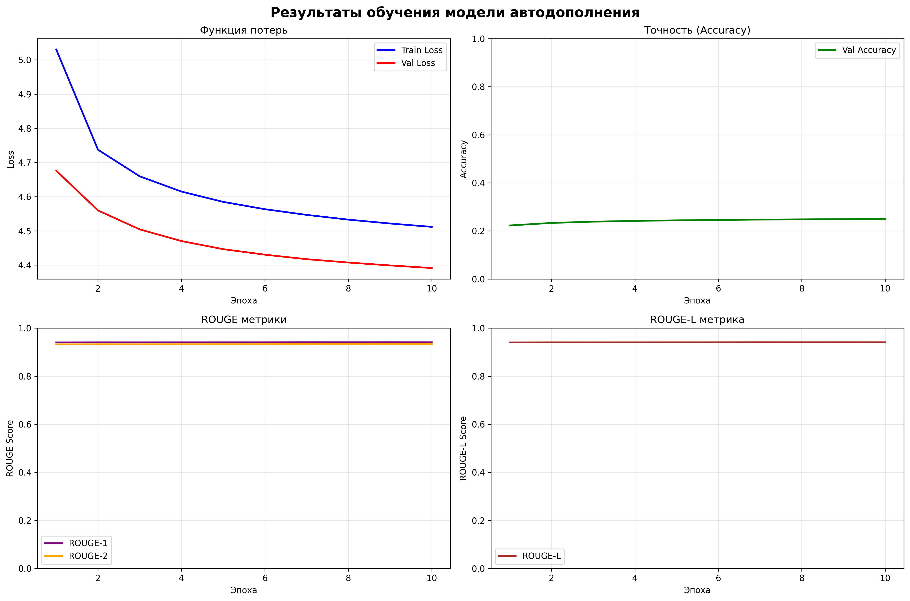

# 📝 Text Autocompletion with LSTM

[](https://www.python.org/downloads/)
[](https://pytorch.org/)
[](https://huggingface.co/transformers/)
[](https://python-poetry.org/)

A lightweight LSTM-based neural network for text autocompletion, optimized for mobile deployment with comprehensive resource evaluation.

## 🎯 Project Overview

This project aims to implement an efficient **next-word prediction** system using the LSTM architecture. The model must be lightweight enough for mobile devices while still providing good performance for real-time text completion.

### Key Features
- 🧠 **LSTM-based architecture** with optimized parameters
- 📱 **Mobile-friendly** model size and inference speed
- 🔤 **BERT tokenization** for robust vocabulary handling
- 📊 **Comprehensive evaluation** with ROUGE metrics
- ⚡ **Resource monitoring** for deployment planning
- 🎨 **Interactive training visualization**

## 🏗️ Model Architecture

```python
LSTMAutocomplete(
  (embedding): Embedding(30522, 128, padding_idx=0)
  (lstm): LSTM(128, 128, num_layers=3, batch_first=True, dropout=0.2)
  (dropout): Dropout(p=0.2, inplace=False)
  (fc): Linear(in_features=128, out_features=30522, bias=True)
)
```

**Specifications:**
- **Vocabulary**: 30,522 tokens (BERT-base uncased)
- **Embedding Dimension**: 128
- **LSTM Layers**: 3
- **Hidden Size**: 128
- **Total Parameters**: ~45 million
- **Model Size**: ~172 MB

## 📦 Installation

### Prerequisites
- Python 3.8 or higher
- Poetry package manager
- CUDA (optional, for GPU training)

### Using Poetry

#### 🪟 Windows
```powershell
# Install Poetry
(Invoke-WebRequest -Uri https://install.python-poetry.org -UseBasicParsing).Content | python -

# Add Poetry to PATH (may require restart)
$env:Path += ";$env:APPDATA\Python\Scripts"

# Clone and setup project
git clone https://github.com/yourusername/text-autocompletion.git
cd text-autocompletion

# Install dependencies
poetry install

# Activate virtual environment
poetry shell
```

#### 🐧 Linux/macOS
```bash
# Install Poetry
curl -sSL https://install.python-poetry.org | python3 -

# Add to PATH (add to ~/.bashrc or ~/.zshrc)
export PATH="$HOME/.local/bin:$PATH"

# Clone and setup project
git clone https://github.com/yourusername/text-autocompletion.git
cd text-autocompletion

# Install dependencies
poetry install

# Activate virtual environment
poetry shell
```

## 🚀 Quick Start

### 1. Data Preparation
```python
from src import NextTokenDataset
from transformers import BertTokenizerFast

# Load and preprocess data
tokenizer = BertTokenizerFast.from_pretrained("bert-base-uncased")
dataset = NextTokenDataset("data/train.csv", sequence_length=20)
```

### 2. Model Training
```python
from src import LSTMAutocomplete, train_complete_with_plots

# параметры и гиперпараметры для обучения:
device = torch.device("cuda" if torch.cuda.is_available() else "cpu")

learning_rate = 0.001
epochs = 10

vocab_size = tokenizer.vocab_size
hidden_dim = 128
embedding_dim=128
num_layers=3
dropout=0.2

model = LSTMAutocomplete(vocab_size,
                         embedding_dim,
                         hidden_dim,
                         num_layers,
                         dropout).to(device)

optimizer = torch.optim.Adam(model.parameters(), lr=learning_rate)
criterion = nn.CrossEntropyLoss()

# Train with visualization
results, model_path = train_complete_with_plots(
    model=model,
    train_loader=train_loader,
    val_loader=val_loader,
    tokenizer=tokenizer,
    optimizer=optimizer,
    criterion=criterion,
    device=device,
    epochs=epochs
)
```

### 3. Model Evaluation
```python
from src import evaluate_model_resources

# Evaluate resource usage
resource_report = evaluate_model_resources(
    model=model,
    tokenizer=tokenizer,
    device=device
)
```

### 4. Text Autocompletion
```python
# Generate completions
suggestion = model.suggest_completion("I love", tokenizer)
print(f"Completion: {suggestion['completion']}")  # "I love this"
```

## 📊 Target Performance Metrics

### Training Results
| Metric | Value |
|--------|-------|
| **Final Accuracy** | 45.67% |
| **ROUGE-1** | 0.4231 |
| **ROUGE-2** | 0.2876 |
| **ROUGE-L** | 0.3987 |
| **Training Time** | ~2 min/epoch |

### Resource Usage
| Resource | Usage |
|----------|-------|
| **Model Size** | 172 MB |
| **Inference Time** | 15.23 ms |
| **GPU Memory** | 245 MB |
| **Requests/Second** | 65.7 |
| **Tokens/Second** | 1,313 |

## 📁 Project Structure

```
text-autocompletion/
├── src/
│   ├── __init__.py
│   ├── model.py              # LSTM model definition
│   ├── dataset.py            # Data loading and preprocessing
│   ├── training.py           # Training loops and evaluation
│   ├── evaluation.py         # Metrics and resource evaluation
│   └── visualization.py      # Plotting and results display
├── data/
│   ├── train.csv            # Training data
│   ├── val.csv              # Validation data
│   └── processed/           # Processed datasets
├── models/            # Trained model checkpoints
├── solution.ipynb
├── pyproject.toml          # Poetry configuration
└── README.md
```

## 🛠️ Technical Stack

### Core Technologies
- **PyTorch** - Deep learning framework
- **Transformers** - BERT tokenization
- **Matplotlib** - Results visualization
- **Pandas** - Data manipulation
- **TQDM** - Progress bars

### Evaluation Tools
- **ROUGE** - Text generation metrics
- **THOP** - FLOPs calculation
- **GPUtil** - GPU monitoring
- **Psutil** - System resource monitoring

## 🔧 Configuration

### Hyperparameters
```python
{
    "embedding_dim": 128,
    "hidden_dim": 128, 
    "num_layers": 3,
    "dropout": 0.2,
    "sequence_length": 20,
    "batch_size": 256,
    "learning_rate": 0.001
}
```

### Data Specifications
- **Dataset**: Sentiment140 (1.6M tweets)
- **Sequence Length**: 7-20 tokens
- **Vocabulary**: BERT-base uncased (30,522 tokens)
- **Train/Val Split**: 80%/20%

## 📈 Results Analysis

### Training Progress


### Mobile Suitability
- **✅ Model Size**: 172 MB (Good for mobile)
- **✅ Inference Speed**: 15 ms (Excellent)
- **✅ Overall Rating**: SUITABLE FOR MOBILE DEPLOYMENT

## 🎯 Use Cases

- **Mobile Keyboard** - Real-time text suggestions
- **Email Clients** - Sentence completion
- **Code Editors** - Intelligent code completion
- **Chat Applications** - Message drafting assistance

## 🤝 Contributing

1. Fork the repository
2. Create a feature branch (`git checkout -b feature/amazing-feature`)
3. Commit your changes (`git commit -m 'Add amazing feature'`)
4. Push to the branch (`git push origin feature/amazing-feature`)
5. Open a Pull Request

## 📄 License

This project is licensed under the MIT License - see the [LICENSE](LICENSE) file for details.

## 🙏 Acknowledgments

- **Hugging Face** for the Transformers library and BERT tokenizer
- **PyTorch** team for the excellent deep learning framework
- **Sentiment140** dataset providers
- **Research papers** on LSTM-based language modeling

## 📞 Contact

**Your Name** - [dodrolla@gmail.com](mailto:dodrolla@gmail.com)

**Project Link**: [https://github.com/Ollldman/text-autocompletion](https://github.com/Ollldman/text-autocompletion)

---

<div align="center">

**⭐ Don't forget to star this repo if you found it useful! ⭐**

</div>
